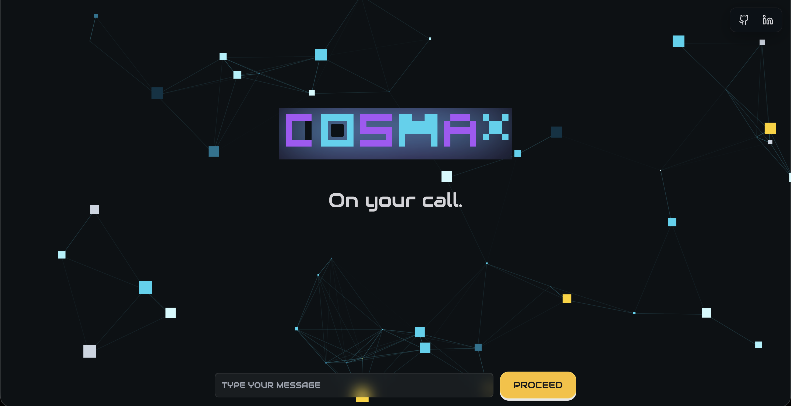
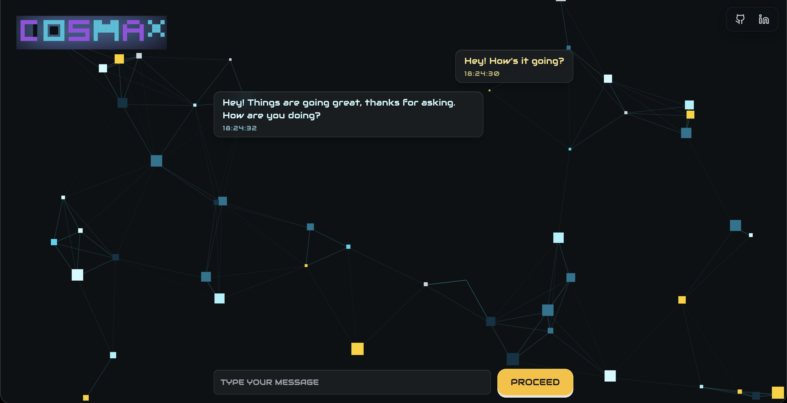

# CosmaX (AI ChatBot · Gemini + React + TypeScript)

A futuristic AI chatbot interface powered by Google Gemini API, built with React, TypeScript, Tailwind CSS, and modular hooks. Designed with a dark JSR-inspired theme, typewriter animations, scroll-aware UI, custom favicon/logo branding, and well-structured architecture.

[Live Project](https://cosmax.vercel.app/)

---

## Preview

<br><br>



<br><br>



---

## Features

- **Gemini API Integration** (real-time chat responses)  
- **Typewriter animation** for bot messages (`useTypewriter` hook)  
- **CosmaX dark theme** (JSR-style background with particles & gradients)  
- **Custom Favicon & Branding** (robotics-inspired SVG logo)  
- **Scroll-to-bottom button** with smooth Framer Motion animations  
- **Chat bubbles with timestamps** styled with glassmorphism  
- **Compact Hero transition** — logo moves from center to corner once chat begins  
- **Responsive macOS-style layout** (mobile & desktop optimized)  
- **Clean modular file structure** with TypeScript typing for messages  

---

## Technologies Used

| Frontend       | Styling       | AI API             | Other Tools   |
| -------------- | ------------- | ------------------ | ------------- |
| React + Vite   | Tailwind CSS  | Gemini API (1.5)   | TypeScript    |
| Framer Motion  | Responsive UI | REST fetch         | ESLint, .env  |

---

## Project Structure

```
src/
├── assets/              # Icons, logos, particles config
├── components/          # UI components (ChatMessage, Composer, Logo, etc.)
├── hooks/               # Custom hooks (useTypewriter)
├── pages/               # Main pages (Home.tsx)
├── services/            # Gemini API calls
├── types/               # Global TypeScript types (chat.ts)
├── App.tsx
├── index.tsx
```

---

## Challenges and Solutions

### 1. Local Storage & Data Security  
- Issue: Avoided storing full user objects in localStorage.  
- Fix: Cleaned up all state handling so only safe message arrays are kept in memory.  

### 2. Typewriter Cut-off Issue  
- Issue: First word sometimes got trimmed.  
- Fix: Added dummy padding in `useTypewriter.ts` and trimmed with regex cleanup.  

### 3. UI Refinements  
- Dark JSR-style background unified across **ParticlesBackground.tsx** & **Home.tsx**.  
- Added **scroll-to-bottom floating button** with Framer Motion.  
- Adjusted Composer’s positioning via `bottomOffset` prop for flexible layouts.  

### 4. Branding & Favicon  
- Designed multiple **robotics-inspired SVG favicons** (emerald, teal, yellow-cyan, dark variants).  
- Fixed spacing between favicon and page title.  

---

## Getting Started

### 1. Clone the Repository

```bash
git clone https://github.com/archit-react/cosmax.git
cd cosmax
```

### 2. Install Dependencies

```bash
npm install
```

### 3. Configure Environment Variables

Create a `.env` file:

```env
VITE_GEMINI_API_KEY=your_gemini_api_key
```

Get your key from: [Google AI Studio](https://aistudio.google.com/app/apikey)

### 4. Start Development Server

```bash
npm run dev
```

---

## Future Improvements

- **Streaming responses** (token-by-token like ChatGPT)  
- **Voice input + speech output**  
- **Persistent chat history with Firebase/DB**  
- **Unit tests** with Vitest + RTL  
- **Multi-language support**  

---

## Author

**Archit Sharma**  
Full-Stack Developer | Chandigarh, India  

- GitHub: [archit-react](https://github.com/archit-react)  
- LinkedIn: [archit-react](https://www.linkedin.com/in/archit-react)  

---

## License

MIT License  
